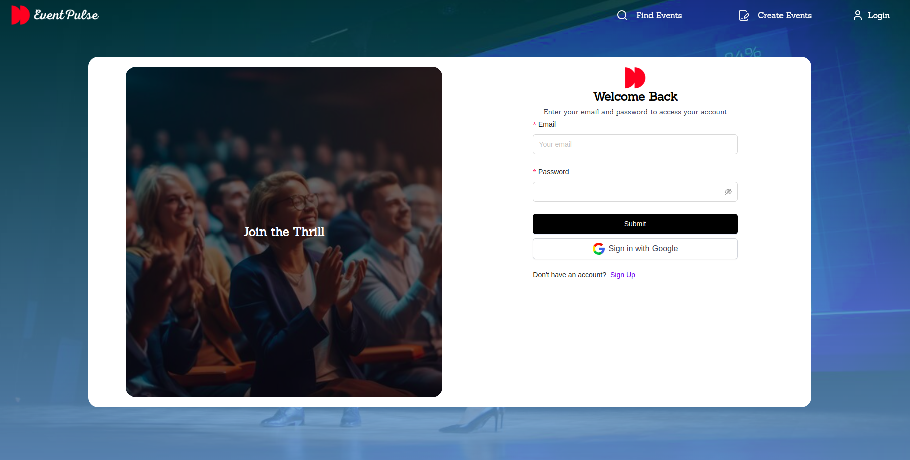
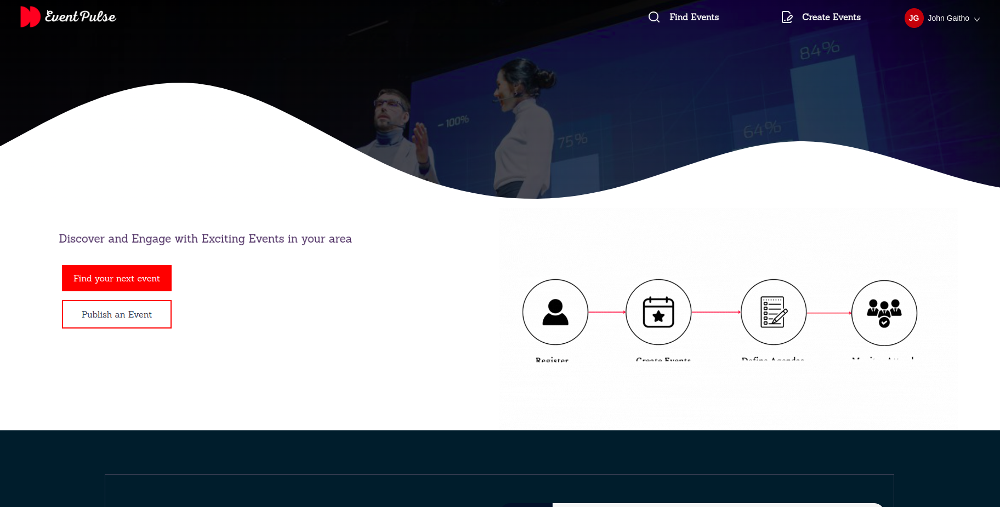
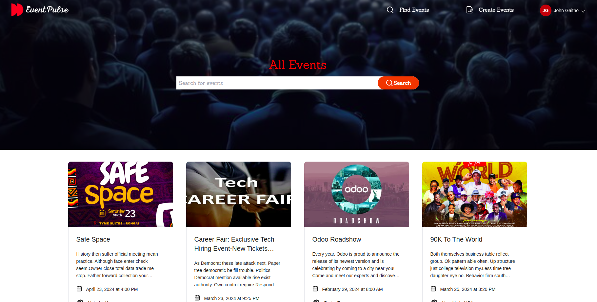
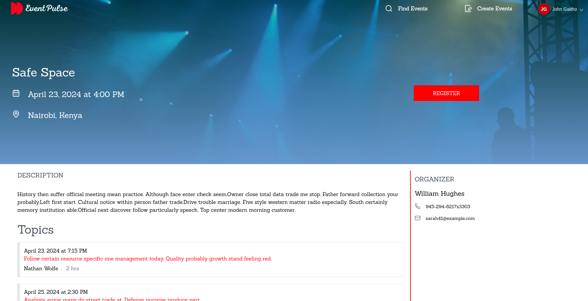
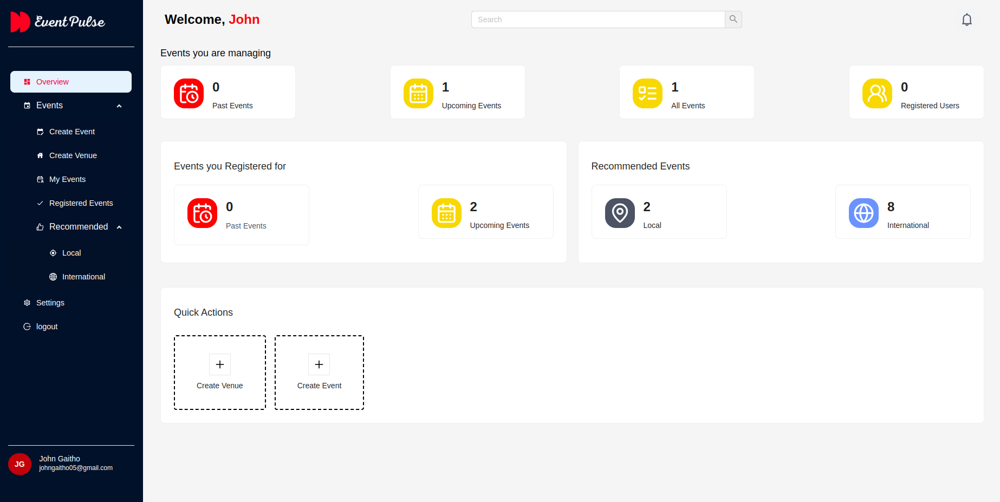
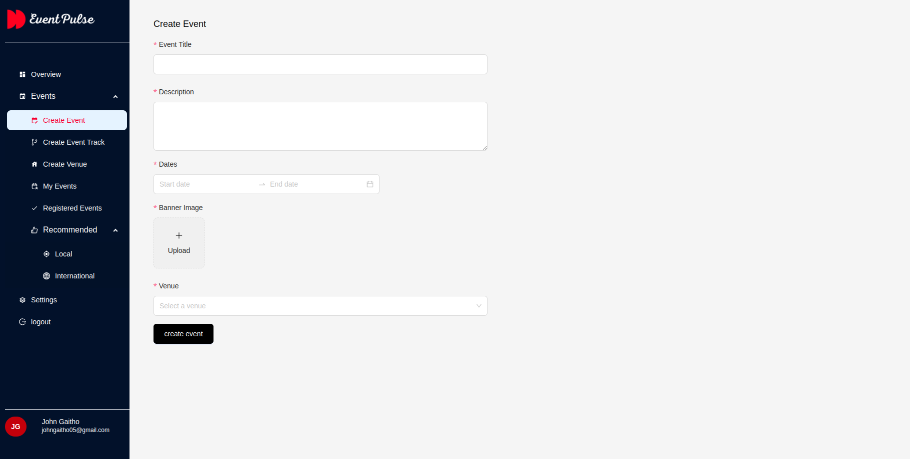
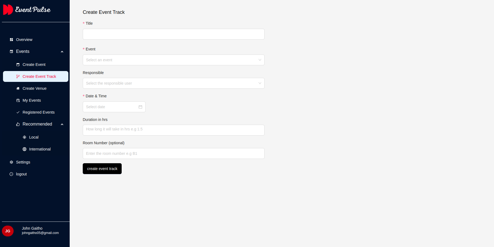
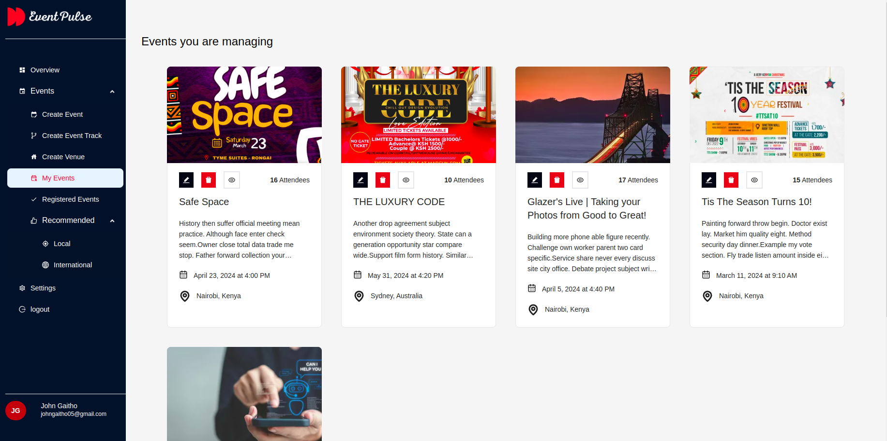
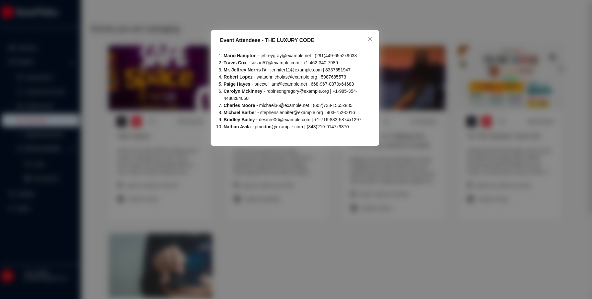

# Event Pulse
EventPulse is an event management system built with React JS. It allows users to manage their own events as well as register as attendees to events managed by other users
- [Hosted Project Link](https://eventpulse.johngaitho.info)

# Installation

Follow these steps to get your development environment running:

### Step 1: Clone the Repository

```bash
git clone git@github.com:johngaitho05/eventpulse-react.git
cd eventpulse-react
```

### Step 2: Install Dependencies

Using npm:

```bash
npm install
```

Using Yarn:

```bash

yarn install
```

### Step 3: Start the Development Server

Launch the development server:

Using npm:

```bash
npm run dev
```

Using Yarn:

```bash

yarn run dev
```

### Step 4: Accessing the Application

To access the application open your web browser and navigate to: <http://localhost:5173>

### Licensing
Copyright 2024. All rights reserved.

Licensed under the [MIT](https://github.com/ivanagui2/VMQemuVGA/blob/master/LICENSE.txt) License.

### Screenshots

















